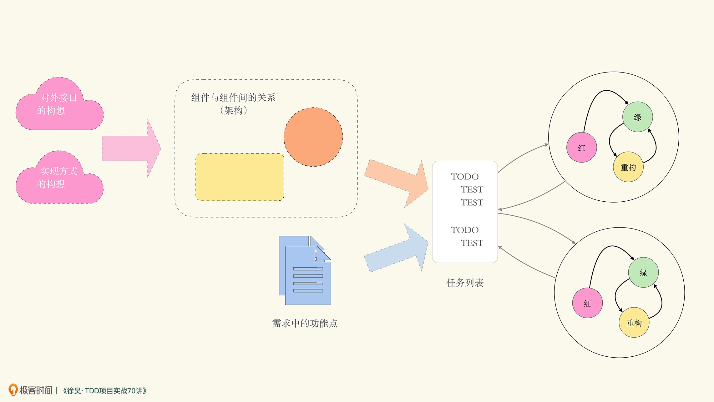

# TDD learning

## 任务分解法与整体工作流程

### TDD 的基本原则

1. 当且仅当存在失败的自动化测试时，才开始编写生产代码；
2. 消除重复。(消除坏味道)

任务分解法的步骤如下：

1. 大致构思软件被使用的方式，把握对外接口的方向；
2. 大致构思功能的实现方式，划分所需的组件（Component）以及组件间的关系（所谓的架构）。当然，如果没思路，也可以不划分；
3. 根据需求的功能描述拆分功能点，功能点要考虑正确路径（Happy Path）和边界条件（Sad Path）；
4. 依照组件以及组件间的关系，将功能拆分到对应组件；
5. 针对拆分的结果编写测试，进入红 / 绿 / 重构循环。

### TDD 的整体工作流程如下图所示：

### 识别坏味道

* 利用多态替换条件分支
* 消除重复(字符串和整形的合二为一)